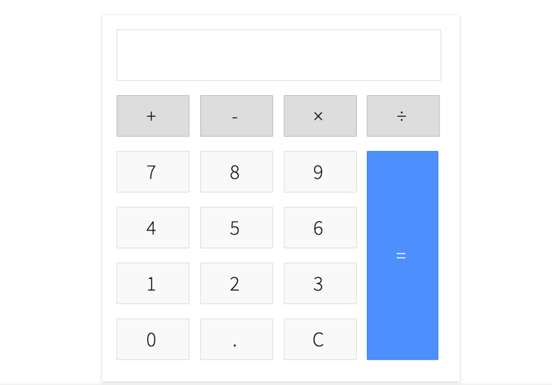

# Einfacher Taschenrechner

Dies ist ein einfacher Taschenrechner, der mit HTML, CSS und JavaScript erstellt wurde. Der Taschenrechner hat eine einfache Benutzeroberfläche mit Ziffern- und Operator-Buttons und kann grundlegende arithmetische Operationen wie Addition, Subtraktion, Multiplikation und Division ausführen.

## Funktionen

- Zwei Zahlen addieren, subtrahieren, multiplizieren und dividieren
- Den Eingabe löschen mit der "C"-Taste
- Das Ergebnis der Berechnung anzeigen

## Anfangen

Um den Taschenrechner zu verwenden, öffne einfach die `index.html`-Datei in einem Webbrowser. Die Benutzeroberfläche des Taschenrechners wird angezeigt und du kannst beginnen, Ziffern und Operatoren einzugeben, um Berechnungen durchzuführen.

